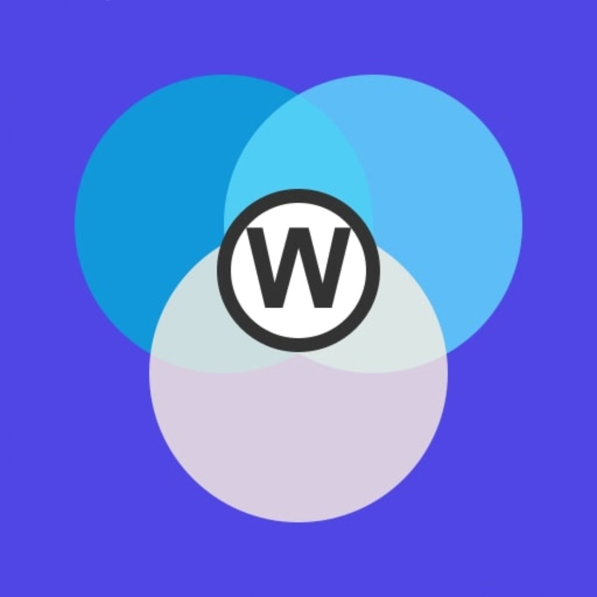

# GoReactive

<div align="center">
  
  
  <h3>Modern Web Starter Template with Go + React + SSR via Bun</h3>
  
  <p>
    <a href="#features">Features</a> •
    <a href="#architecture">Architecture</a> •
    <a href="#setup">Setup</a> •
    <a href="#development">Development</a> •
    <a href="#deployment">Deployment</a> •
    <a href="#license">License</a>
  </p>
</div>

## Overview

GoReactive is a modern web application starter template that combines the power of Go for backend services with React and shadcn/ui for the frontend. What makes this template unique is its approach to SSR (Server-Side Rendering): since React doesn't provide a native API for Go to perform SSR, this template leverages Bun.js running on a Unix socket to handle SSR operations on behalf of Go.

## Features

- **Go Backend**: Fast, efficient API server with Go's powerful standard library
- **React Frontend**: Modern component-based UI with the full React ecosystem
- **shadcn/ui**: Beautiful, accessible, and customizable UI components
- **SSR Support**: Server-side rendering via Bun.js integration
- **Production Ready**: Optimized build process for both development and production
- **Type Safety**: TypeScript throughout the frontend codebase
- **Hot Reloading**: Fast development experience with hot module replacement
- **Performance**: Optimized for both initial load and runtime performance

## Architecture

The project uses a unique architecture to enable SSR with Go and React:

1. **Go Backend**: Handles API requests, business logic, and serves the application
2. **React Frontend**: Built with modern React patterns and shadcn/ui
3. **Bun.js SSR Bridge**: Since Go cannot directly render React components, Bun.js is used as a bridge:
   - Go calls Bun.js through a Unix socket
   - Bun renders React components to HTML
   - Go serves the rendered HTML to clients
   - Client-side hydration takes over for interactivity

<!--
<div align="center">
  
</div>
-->

## Setup

### Prerequisites

- Go 1.23.6+
- Bun 1.2.2+ (required for SSR)
- Unix-like operating system (Linux, macOS)

### Installation

1. Clone the repository:

```bash
git clone https://github.com/jelius-sama/go_reactive.git
cd go_reactive
```

2. Install dependencies:

```bash
# Install Go dependencies
go mod download

# Install frontend dependencies
cd client
bun install
cd ..

# Install Bun (if not already installed)
curl -fsSL https://bun.sh/install | bash
```

3. Configure environment:

```bash
cp .env.example .env
# Edit .env file with your configuration
```

## Development

Start the development server:

```bash
make dev
```

This command:
- Starts the Go backend server
- Runs Bun in development mode for frontend
- Establishes the SSR bridge via Unix socket
- Enables hot reloading for both Go and React code

## Building for Production

```bash
make compile-prod
```

This creates:
- Compiled Go binary
- Optimized React build
- Bundled SSR handler for Bun

## Deployment

The application can be archieved as a `.gz` file and then copied over to your VPS and unzipped there for easy deployment (by default .env are not included in the archieve but this can be changed).

```bash
# Build everything
make gen-prod

# Run the server
./bin/your-app-name
```

## Project Structure

```
.
├── assets
├── bin
├── client
│   ├── scripts
│   └── src
│       ├── components
│       │   └── layout
│       │   └── ui
│       ├── contexts
│       ├── hooks
│       ├── lib
│       ├── pages
│       └── types
├── cmd
├── internal
│   ├── api
│   ├── config
│   ├── middleware
│   ├── ssr
│   ├── types
│   └── util
├── shared
└── tmp
```

## SSR Implementation Details

The SSR process works as follows:

1. When a request comes in, Go determines if it needs to be SSR'd
2. If SSR is needed, Go prepares the data and calls the Bun.js process via Unix socket
3. Bun renders the React component with the provided data
4. The rendered HTML is returned to Go, which serves it to the client
5. The client receives HTML with data and hydrates the React application

This approach gives you the best of both worlds: Go's performance and React's component model, with proper SEO through SSR.

## Performance Considerations

- The Unix socket communication between Go and Bun is optimized for minimal latency
- Rendered pages can be cached when appropriate (not default)
- React hydration is configured for optimal performance

## Contributing

Contributions are welcome! Please feel free to submit a Pull Request.

## License

This project is licensed under the MIT License - see the LICENSE file for details.

---

*Note: All images in the assets folder were generated by Claude.ai*
